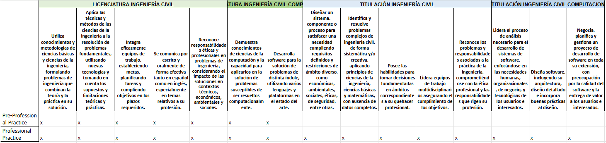
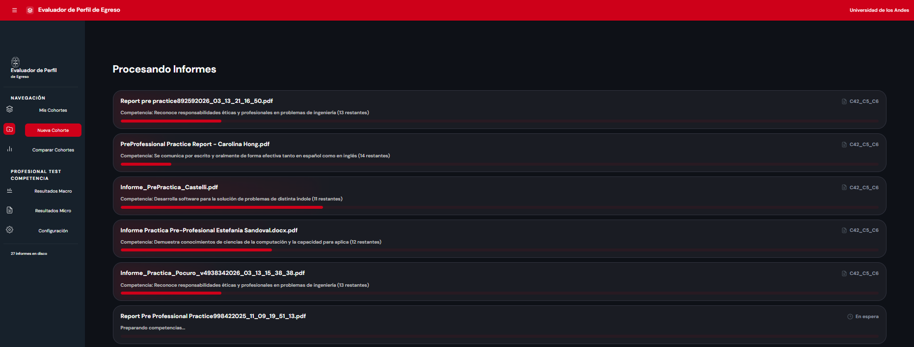
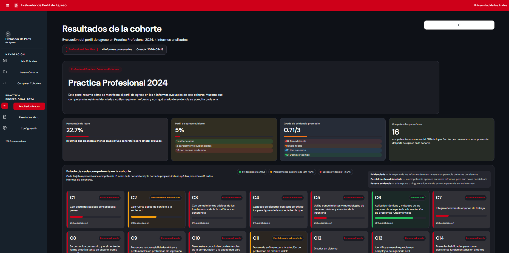
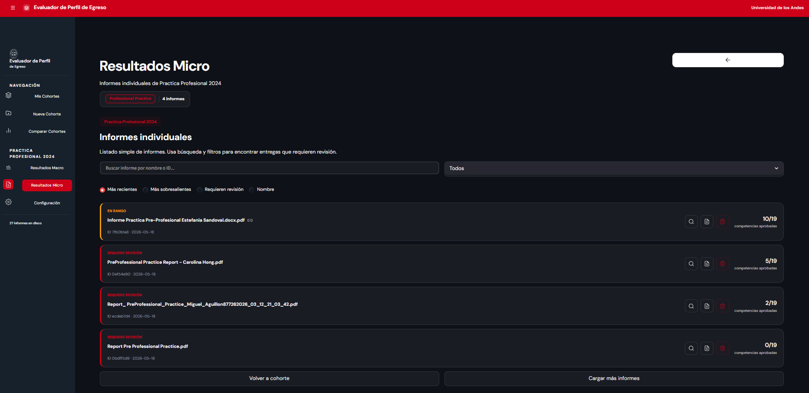
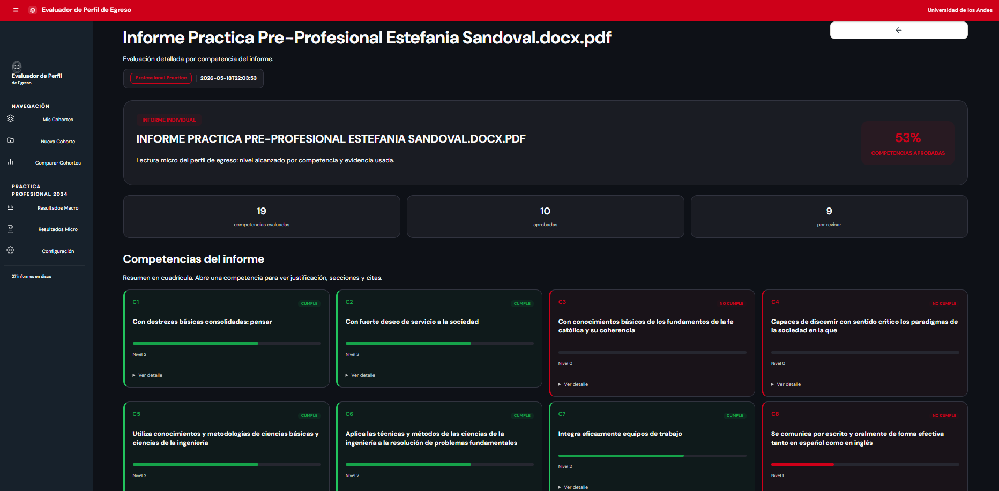
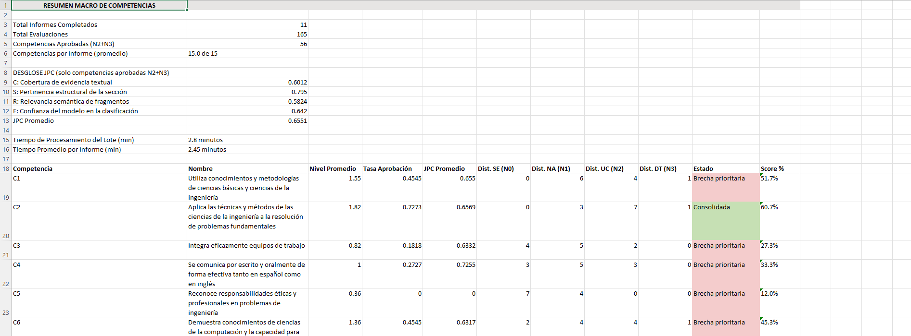
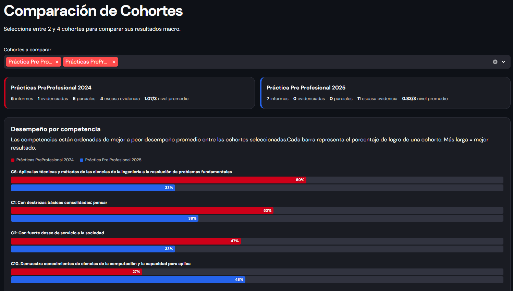
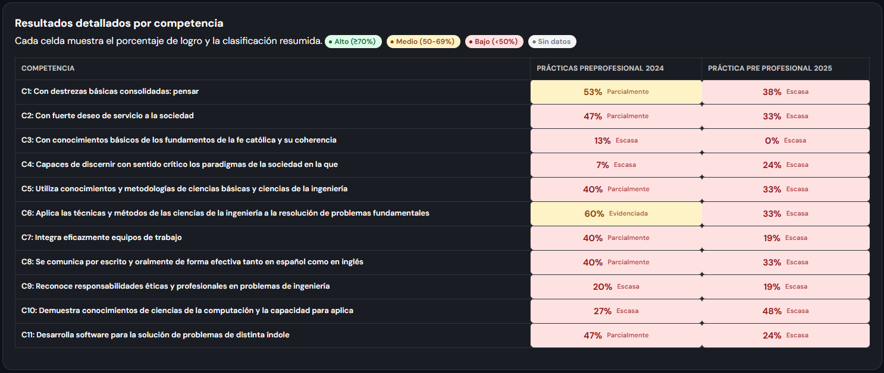
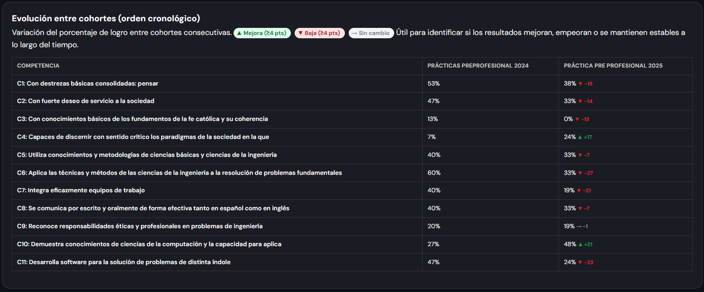

# Manual de Usuario — Evaluador de Perfil de Egreso

## 1. Instrucciones paso a paso

### 1.1 Primer uso: configurar las API keys
Copia el archivo de ejemplo y edítalo con tus claves:

```bash
cp .env.example .env
```

| Variable | Proveedor | Uso                                         |
|----------|-----------|---------------------------------------------|
| `GEMINI_API_KEY` | Google Gemini | Embeddings (modelo `gemini-embedding-2`)    |
| `OPENAI_API_KEY` | OpenAI  | Embeddings (modelo `text-embedding-3-small`) |
| `OPENROUTER_API_KEY` | OpenRouter | Evaluación LLM                         |


#### 1. OpenAI

Consigue una clave en [platform.openai.com/api-keys](https://platform.openai.com/api-keys).

En el archivo `.env`, pégala en `OPENAI_API_KEY`. El modelo usado es `text-embedding-3-small` para embeddings y `gpt-4o-mini` para evaluación por LLM.

OpenAI opera con créditos prepagos; la facturación es por uso (tokens). Revisa sus [políticas de uso de datos](https://openai.com/policies/api-data-usage) para conocer cómo se manejan los datos enviados.

#### 2. OpenRouter

Consigue una clave en [openrouter.ai/keys](https://openrouter.ai/keys).

En el archivo `.env`, pégala en `OPENROUTER_API_KEY`. OpenRouter permite usar múltiples modelos de distintos proveedores desde una sola API. El modelo por defecto es `openrouter/free`.

Puedes explorar [todos los modelos disponibles](https://openrouter.ai/models) o los [modelos gratuitos](https://openrouter.ai/collections/free-models).

#### 3. Google AI Studio (Gemini)

Consigue una clave de Gemini API en [Google AI Studio](https://aistudio.google.com/apikey).

En el archivo `.env`, pégala en `GEMINI_API_KEY`. El modelo usado es `models/gemini-embedding-2` para embeddings.

La API de Gemini expone un endpoint compatible con OpenAI en `https://generativelanguage.googleapis.com/v1beta/openai/`. Los límites de la capa gratuita varían por modelo. Revisa los [términos de Google](https://ai.google.dev/gemini-api/docs/terms) para conocer cómo se manejan los datos.

### 1.2 Crear una cohorte y subir informes

1. Desde la página principal, haz clic en **"Nueva Cohorte"**.
2. Ingresa un nombre para la cohorte (ej. "Práctica Pre-Profesional 2025").
3. Arrastra y suelta los archivos PDF (o un ZIP con varios PDFs) en el área de carga.
4. Selecciona el tipo de práctica: **Pre-Profesional** o **Profesional**.
5. (Opcional) Sube una matriz de competencias personalizada (CSV) o una rúbrica (JSON). Si no se sube ningun archivo, se usarán los defaults 
[matriz.csv](config/matriz.csv) y [rubrica.json](config/rubrica.json)

Ejemplo de rubrica.json (si se quiere crear una rubrica)
```json
{
  "pre_professional_practice": {
    "abstract": {
      "peso": 0.10,
      "subsecciones": {
        "abstract": 0.10
      }
    },
    "introduccion": {
      "peso": 0.1,
      "subsecciones": {
        "department_area_description": 0.05,
        "company_description": 0.05
      }
    },
    "trabajo_realizado": {
      "peso": 0.30,
      "subsecciones": {
        "most_challenge_activity": 0.20,
        "general_activities": 0.10
      }
    },
    "analisis": {
      "peso": 0.30,
      "subsecciones": {
        "company_analysis": 0.10,
        "work_analysis": 0.20
      }
    },
    "reflexion_personal": {
      "peso": 0.20,
      "subsecciones": {
        "personal_reflection": 0.20
      }
    }
  }
}
```

Ejemplo matriz.csv (si se quiere crear una matriz debe seguir este formato)


6. Haz clic en **"Crear Cohorte"**.
7. El sistema comenzará a procesar los informes automáticamente.

### 1.3 Monitorear el procesamiento

1. Durante el procesamiento, la vista **"Procesando"** muestra:
   - Barra de progreso global.
   - Progreso individual de cada informe (qué capa del pipeline está ejecutando).
   - Progreso por competencia dentro de cada informe.
2. Puedes navegar a otras vistas mientras se procesa; el sistema continúa en segundo plano.
3. Al finalizar, serás redirigido automáticamente a la vista de resultados macro.

### 1.4 Revisar resultados
1. En **"Resultados Macro"** (vista por defecto tras el procesamiento), observa:
   - Gráfico de barras con el promedio por competencia en toda la cohorte.
   - Tabla resumen con niveles promedio y desglose JPC.

2. Haz clic en **"Resultados Micro"**, haz clic en un informe específico para ver su **detalle completo**.



### 1.5 Exportar resultados a Excel

1. Desde la vista **"Configuración"** de la cohorte (o desde el detalle de informe), haz clic en **"Exportar a Excel"**.

### 1.6 Comparar dos cohortes

1. Desde el menú lateral, selecciona **"Comparar Cohortes"**.
2. Elige dos cohortes de los menús desplegables.
3. El sistema mostrará gráficos comparativos lado a lado por competencia.
 


---

## 2. Consideraciones relevantes

### 2.1 Privacidad y datos

- Los informes de estudiantes y sus evaluaciones se almacenan localmente en el servidor donde se ejecuta la aplicación.
- Los datos enviados a APIs externas (Google Gemini, OpenAI, OpenRouter) están sujetos a las políticas de privacidad de cada proveedor. Se recomienda no incluir información sensible sin consultar con la unidad de protección de datos de la institución.
- El sistema no comparte datos entre distintas instalaciones ni los utiliza para entrenar modelos (salvo que el proveedor lo haga por defecto en su capa gratuita; revisar términos de servicio).

### 2.2 Respaldos

- Los datos se almacenan en la carpeta `data/` del proyecto. Se recomienda realizar respaldos periódicos de esta carpeta.
- El archivo Excel exportado sirve como respaldo de los resultados de evaluación.

### 2.3 Personalización

- La **matriz de competencias** (`config/matriz.csv`) puede modificarse para reflejar el perfil de egreso de cada carrera.
- La **rúbrica** (`config/rubrica.json`) puede ajustarse para cambiar las secciones evaluadas o sus pesos relativos.
- Los **niveles de evaluación** (0–3) y sus etiquetas están definidos en la configuración del pipeline.
